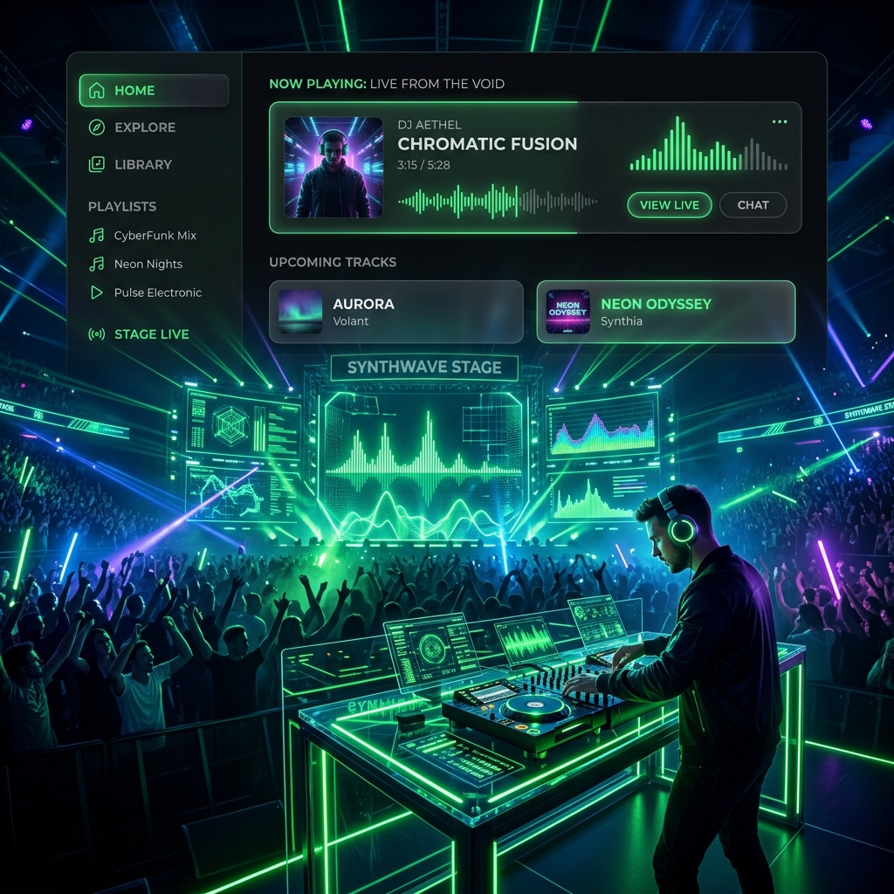

  _______                  ______           __  _     
 |__   __|                |  ____|         | | (_)    
    | | _   _  _ __    ___| |__  __ _  ___ | |_ _  ___ 
    | || | | || '_ \  / _ \  __|/ _` |/ __|| __| |/ __|
    | || |_| || | | ||  __/ |  | (_| |\__ \| |_| | (__ 
    |_| \__,_||_| |_| \___|_|   \__,_||___/ \__|_|\___|



# TuneTastic Web

Welcome to **TuneTastic**, a premium, high-performance music streaming web application built with React, TypeScript, and the Web Audio API. 

TuneTastic goes beyond standard music playback by featuring a **Live DJ Soundstage** that gives you real-time, zero-latency control over a massive suite of studio-grade audio effects and manipulations right in your browser.

---

## 🌟 Key Features

### 🎛️ Live DJ Soundstage (Web Audio API)
Take control of the music with a fully custom-built audio processing graph that modifies tracks in real-time without glitching or lagging:
- **Bass Boost:** Deep, thumping low-end enhancement (LowShelf Filter).
- **Reverb / Echo:** Add stadium-sized space to your tracks with a precisely tuned delay and feedback loop.
- **8D Surround Spin:** Immersive stereo panning that spins the audio 360° around your head.
- **Nightcore Mode:** Increases playback speed and pitch for high-energy anime/hyperpop vibes.
- **Lo-Fi Mode:** Warm, muffled, low-pass filtered sound perfect for studying or chilling.
- **Karaoke / Vocal Boost:** Amplifies the mid-range frequencies to make vocals punch through the mix.
- **Phaser Sweep:** Trippy, psychedelic swirling frequency modulations.
- **Vinyl Overdrive:** Gritty, vintage harmonic distortion (WaveShaper).
- **Tremolo Pulse:** Rhythmic heartbeat volume modulation.
- **Chorus:** Multi-voice widening effect using microscopic delays.

### 🎨 Premium UI/UX Design
- **Glassmorphism:** Frosted glass elements, dynamic blurred backgrounds, and sleek borders.
- **Interactive Visualizers:** CSS-driven beat visualizers that react to playback state with zero JavaScript lag.
- **Smooth Animations:** Every interaction features micro-animations and physics-based scaling to feel incredibly responsive and tactile.

### ☁️ Cloudinary Music Delivery
- All tracks and album artwork are seamlessly delivered via Cloudinary's high-speed CDN, allowing for robust CORS-enabled streaming directly into the Web Audio graph.

---

## 🛠️ Tech Stack

- **Framework:** React 18 (Hooks, Context API)
- **Language:** TypeScript
- **Build Tool:** Vite for lightning-fast HMR and optimized production builds.
- **Styling:** Custom Vanilla CSS tailored for modern UI paradigms (CSS Variables, Flexbox/Grid, Keyframe Animations).
- **Audio Engine:** Native HTML5 `<audio>` integrated with the powerful **Web Audio API**.
- **Icons:** Lucide React

---

## 🧠 Architecture Overview

### The Audio Graph
TuneTastic solves the notorious React-Audio lifecycle problem. Traditional React apps struggle to keep Web Audio API nodes connected when components re-render or when React Strict Mode is enabled. 

TuneTastic uses a strictly controlled `PlayerContext` that safely initializes the `AudioContext` only after a user interaction, seamlessly attaches a `MediaElementAudioSourceNode` to a persistent, detached `<audio>` element, and routes the signal through a massive, statically-constructed effect chain:

`Source -> Vinyl -> Bass -> Telephone -> Vocal -> Phaser -> Lo-Fi -> Alien RingMod -> Tremolo -> Panner -> Destination`

Parallel wet-signal paths are handled for Echo (Delay + Feedback Mix) and Chorus to prevent signal degradation and the dreaded "double voice" phase-cancellation issues. Side-effects are precisely synchronized with UI state via optimized `useEffect` hooks, completely bypassing closure-staleness.

---

## 🚀 Getting Started

To run TuneTastic locally:

1. **Clone the repository:**
   ```bash
   git clone https://github.com/yourusername/tunetastic-web.git
   cd tunetastic-web
   ```

2. **Install dependencies:**
   ```bash
   npm install
   ```

3. **Start the development server:**
   ```bash
   npm run dev
   ```

4. Open your browser and navigate to `http://localhost:5173`.

---

## 📝 License
This project is for educational and portfolio purposes. Feel free to fork and explore the Web Audio API capabilities!
